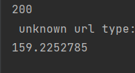
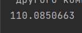
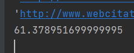
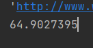

## Потоки и асинхронность

# 1 часть
Измерено время работы программы:

Время работы переписанной программы с 5 воркерами:

C 10 воркерами:

С 100 воркерами:

От количества воркеров сильно возросла скорость приема данных, показатели оперативной памяти и процессора не изменились

# 2 часть

При увеличении количества воркеров больше 8 скорость не увеличивается, так как логических ядер на компьютере 8.
При работе любого количества воркеров загруженность процессора не отходила от 25%